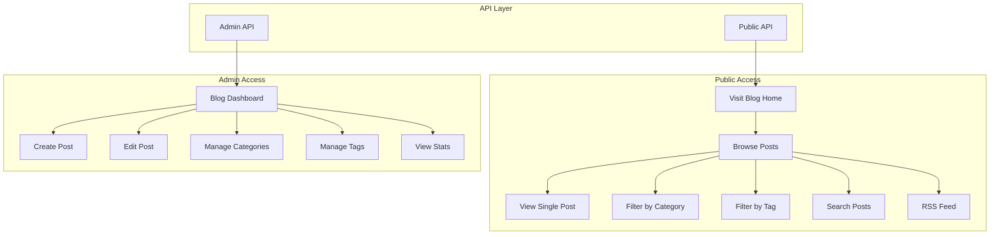

# Blog Module Architecture Document

## 1. Module Overview

The Blog Module is designed as a standalone microservice within the existing CodeIgniter 4 application. It provides a complete blogging platform optimized for educational content with AI-enhanced features and comprehensive SEO capabilities.

### 1.1 Module Goals

- **Public Access**: Allow visitors to read educational blog posts without authentication
- **Admin Management**: Enable administrators to create, edit, and manage blog content with SEO optimization
- **API-First Design**: Provide RESTful API endpoints for potential future extraction as a standalone service
- **SEO Optimized**: Full support for meta tags, slugs, sitemaps, and structured data
- **AI-Ready**: Framework for AI-generated content summaries and recommendations

### 1.2 Module Structure

```
app/Modules/Blog/
├── Config/
│   ├── Menu.php              # Admin menu configuration
│   ├── Routes.php            # Route definitions
│   └── Blog.php              # Blog-specific configuration
├── Controllers/
│   ├── BlogController.php    # Admin management controller
│   ├── CategoryController.php # Category management
│   ├── Api/
│   │   └── BlogApiController.php # Public API endpoints
│   └── Frontend/
│       └── BlogController.php # Public-facing blog pages
├── Models/
│   ├── BlogPostModel.php     # Blog post CRUD and queries
│   ├── BlogCategoryModel.php # Category management
│   └── BlogTagModel.php      # Tag management
├── Views/
│   ├── admin/
│   │   ├── index.php         # Blog posts list
│   │   ├── create.php        # Create new post
│   │   ├── edit.php          # Edit existing post
│   │   └── categories/
│   │       ├── index.php    # Categories list
│   │       └── form.php     # Category form
│   └── frontend/
│       ├── index.php         # Blog listing page
│       ├── post.php          # Single post view
│       ├── category.php      # Category archive
│       └── tag.php           # Tag archive
├── Database/
│   └── Migrations/
│       └── 2026-03-04-000001_CreateBlogTables.php
└── Language/
    └── en/
        └── Blog.php          # Language strings
```

---

## 2. Database Schema

### 2.1 Blog Posts Table (`blog_posts`)

| Column             | Type         | Constraints                 | Description                          |
| ------------------ | ------------ | --------------------------- | ------------------------------------ |
| `id`               | INT          | PRIMARY KEY, AUTO_INCREMENT | Unique identifier                    |
| `title`            | VARCHAR(255) | NOT NULL                    | Post title                           |
| `slug`             | VARCHAR(255) | UNIQUE, NOT NULL            | SEO-friendly URL slug                |
| `content`          | LONGTEXT     | NOT NULL                    | Full article content (HTML/Markdown) |
| `excerpt`          | TEXT         | NULLABLE                    | Short description for previews       |
| `featured_image`   | VARCHAR(500) | NULLABLE                    | URL to featured image                |
| `author_id`        | INT          | NOT NULL, FOREIGN KEY       | Reference to users table             |
| `category_id`      | INT          | NULLABLE, FOREIGN KEY       | Reference to blog_categories         |
| `meta_title`       | VARCHAR(70)  | NULLABLE                    | SEO meta title (max 70 chars)        |
| `meta_description` | VARCHAR160)  | NULLABLE                    | SEO meta description (max 160 chars) |
| `meta_keywords`    | VARCHAR(255) | NULLABLE                    | Comma-separated keywords             |
| `reading_time`     | INT          | DEFAULT 0                   | Estimated reading time in minutes    |
| `view_count`       | INT          | DEFAULT 0                   | Number of views                      |
| `is_published`     | TINYINT(1)   | DEFAULT 0                   | Publication status                   |
| `is_featured`      | TINYINT(1)   | DEFAULT 0                   | Featured post flag                   |
| `ai_summary`       | TEXT         | NULLABLE                    | AI-generated content summary         |
| `ai_keywords`      | VARCHAR(500) | NULLABLE                    | AI-detected keywords                 |
| `published_at`     | DATETIME     | NULLABLE                    | Scheduled publication time           |
| `created_at`       | DATETIME     | NOT NULL                    | Creation timestamp                   |
| `updated_at`       | DATETIME     | NOT NULL                    | Last update timestamp                |

### 2.2 Blog Categories Table (`blog_categories`)

| Column          | Type         | Constraints                 | Description                   |
| --------------- | ------------ | --------------------------- | ----------------------------- |
| `id`            | INT          | PRIMARY KEY, AUTO_INCREMENT | Unique identifier             |
| `name`          | VARCHAR(100) | NOT NULL                    | Category name                 |
| `slug`          | VARCHAR(100) | UNIQUE, NOT NULL            | SEO-friendly URL slug         |
| `description`   | TEXT         | NULLABLE                    | Category description          |
| `image`         | VARCHAR(500) | NULLABLE                    | Category image URL            |
| `parent_id`     | INT          | NULLABLE, FOREIGN KEY       | Parent category for hierarchy |
| `display_order` | INT          | DEFAULT 0                   | Sort order                    |
| `is_active`     | TINYINT(1)   | DEFAULT 1                   | Active status                 |
| `created_at`    | DATETIME     | NOT NULL                    | Creation timestamp            |
| `updated_at`    | DATETIME     | NOT NULL                    | Last update timestamp         |

### 2.3 Blog Tags Table (`blog_tags`)

| Column       | Type        | Constraints                 | Description           |
| ------------ | ----------- | --------------------------- | --------------------- |
| `id`         | INT         | PRIMARY KEY, AUTO_INCREMENT | Unique identifier     |
| `name`       | VARCHAR(50) | NOT NULL, UNIQUE            | Tag name              |
| `slug`       | VARCHAR(50) | NOT NULL, UNIQUE            | SEO-friendly URL slug |
| `created_at` | DATETIME    | NOT NULL                    | Creation timestamp    |

### 2.4 Blog Post Tags Pivot Table (`blog_post_tags`)

| Column      | Type              | Constraints           | Description             |
| ----------- | ----------------- | --------------------- | ----------------------- |
| `post_id`   | INT               | FOREIGN KEY           | Reference to blog_posts |
| `tag_id`    | INT               | FOREIGN KEY           | Reference to blog_tags  |
| PRIMARY KEY | (post_id, tag_id) | Composite primary key |

### 2.5 Blog Settings Table (`blog_settings`)

| Column          | Type        | Constraints                 | Description           |
| --------------- | ----------- | --------------------------- | --------------------- |
| `id`            | INT         | PRIMARY KEY, AUTO_INCREMENT | Unique identifier     |
| `setting_key`   | VARCHAR(50) | NOT NULL, UNIQUE            | Setting identifier    |
| `setting_value` | TEXT        | NULLABLE                    | Setting value         |
| `created_at`    | DATETIME    | NOT NULL                    | Creation timestamp    |
| `updated_at`    | DATETIME    | NOT NULL                    | Last update timestamp |

---

## 3. API Endpoints Design

### 3.1 Public API Endpoints (No Authentication Required)

| Method | Endpoint                     | Description                      |
| ------ | ---------------------------- | -------------------------------- |
| GET    | `/api/blog/posts`            | List published posts (paginated) |
| GET    | `/api/blog/posts/:slug`      | Get single post by slug          |
| GET    | `/api/blog/posts/featured`   | Get featured posts               |
| GET    | `/api/blog/categories`       | List all categories              |
| GET    | `/api/blog/categories/:slug` | Get category by slug with posts  |
| GET    | `/api/blog/tags`             | List all tags                    |
| GET    | `/api/blog/tags/:slug`       | Get tag by slug with posts       |
| GET    | `/api/blog/search`           | Search posts by keyword          |
| GET    | `/api/blog/sitemap.xml`      | XML sitemap for SEO              |
| GET    | `/api/blog/feed`             | RSS/Atom feed                    |

### 3.2 Admin API Endpoints (Authentication Required)

| Method | Endpoint                              | Description                       |
| ------ | ------------------------------------- | --------------------------------- |
| GET    | `/api/admin/blog/posts`               | List all posts (including drafts) |
| POST   | `/api/admin/blog/posts`               | Create new post                   |
| GET    | `/api/admin/blog/posts/:id`           | Get post by ID                    |
| PUT    | `/api/admin/blog/posts/:id`           | Update post                       |
| DELETE | `/api/admin/blog/posts/:id`           | Delete post                       |
| POST   | `/api/admin/blog/posts/:id/toggle`    | Toggle publish status             |
| POST   | `/api/admin/blog/posts/:id/feature`   | Toggle featured status            |
| GET    | `/api/admin/blog/categories`          | List categories                   |
| POST   | `/api/admin/blog/categories`          | Create category                   |
| PUT    | `/api/admin/blog/categories/:id`      | Update category                   |
| DELETE | `/api/admin/blog/categories/:id`      | Delete category                   |
| GET    | `/api/admin/blog/tags`                | List tags                         |
| POST   | `/api/admin/blog/tags`                | Create tag                        |
| DELETE | `/api/admin/blog/tags/:id`            | Delete tag                        |
| POST   | `/api/admin/blog/ai/generate-summary` | AI generate summary               |
| GET    | `/api/admin/blog/stats`               | Get blog statistics               |

---

## 4. Route Definitions

### 4.1 Admin Routes

```
/admin/blog                  → BlogController::index()     - Dashboard/list
/admin/blog/create          → BlogController::create()    - Create form
/admin/blog/store           → BlogController::store()     - Save new post
/admin/blog/edit/(:num)     → BlogController::edit/$1     - Edit form
/admin/blog/update/(:num)    → BlogController::update/$1   - Update post
/admin/blog/delete/(:num)   → BlogController::delete/$1   - Delete post
/admin/blog/toggle/(:num)   → BlogController::toggle/$1   - Toggle publish
/admin/blog/feature/(:num)   → BlogController::feature/$1  - Toggle featured
/admin/blog/categories       → CategoryController::index() - Categories list
/admin/blog/categories/store → CategoryController::store() - Save category
/admin/blog/categories/edit/(:num) → CategoryController::edit/$1
/admin/blog/categories/delete/(:num) → CategoryController::delete/$1
```

### 4.2 Public Routes

```
/blog                       → Frontend\BlogController::index()   - Blog listing
/blog/(:slug)              → Frontend\BlogController::post/$1    - Single post
/blog/category/(:slug)    → Frontend\BlogController::category/$1 - Category archive
/blog/tag/(:slug)          → Frontend\BlogController::tag/$1     - Tag archive
/blog/search               → Frontend\BlogController::search()    - Search results
/blog/feed                 → Frontend\BlogController::feed()      - RSS feed
```

### 4.3 API Routes

```
/api/blog/...               → Api\BlogApiController (public endpoints)
/api/admin/blog/...         → Api\BlogAdminController (protected endpoints)
```

---

## 5. SEO Features

### 5.1 Automatic SEO Features

1. **Slug Generation**
   - Auto-generate URL-friendly slug from title
   - Handle duplicates by appending incremental numbers
   - Allow manual slug override

2. **Meta Tags**
   - Meta title with character limit validation (60-70 chars)
   - Meta description with character limit validation (150-160 chars)
   - Meta keywords (comma-separated)
   - Canonical URL automatic generation

3.\*\*

- og:title, \*\*Open Graph Tags og:description, og:image
- og:type = "article"
- og:url (canonical)
- og:site_name

4. **Twitter Card Tags**
   - twitter:card = "summary_large_image"
   - twitter:title, twitter:description, twitter:image

5. **Structured Data (JSON-LD)**
   - Article schema with:
     - headline, image, author, publishedDate, modifiedDate
     - description, articleSection, keywords
   - BreadcrumbList schema for navigation

6. **Sitemap**
   - XML sitemap at `/blog/sitemap.xml`
   - Include all published posts, categories
   - Priority and changefreq for each content type
   - Auto-discovery via robots.txt

7. **RSS Feed**
   - Atom/RSS feed at `/blog/feed`
   - Include latest 20 published posts

---

## 6. AI Features

### 6.1 Implemented AI Capabilities

1. **Content Summary Generation**
   - AI-generated excerpt/summary from content
   - Placeholder for API integration (OpenAI, Claude, etc.)
   - Stored in `ai_summary` field

2. **Keyword Extraction**
   - AI-detected keywords from content
   - Stored in `ai_keywords` field
   - Used for SEO optimization suggestions

3. **Reading Time Calculation**
   - Automatic calculation based on word count
   - Average reading speed: 200 words/minute
   - Displayed on post cards and article header

4. **Related Posts Algorithm**
   - Based on category, tags, and keyword similarity
   - Configurable number of related posts (default: 3)
   - Displayed at bottom of each article

5. **Content Analysis**
   - SEO score calculation
   - Suggestions for improvement
   - Placeholder structure for expansion

### 6.2 AI Integration Points

```php
// Placeholder for AI service integration
class AIService
{
    public function generateSummary(string $content): string;
    public function extractKeywords(string $content): array;
    public function analyzeSEO(string $content, array $meta): array;
    public function getRelatedPosts(int $postId, array $posts): array;
}
```

---

## 7. Permission Structure

### 7.1 Blog Permissions

| Permission               | Description                    |
| ------------------------ | ------------------------------ |
| `blog.manage`            | Full access to blog management |
| `blog.create`            | Can create new posts           |
| `blog.edit`              | Can edit existing posts        |
| `blog.delete`            | Can delete posts               |
| `blog.categories.manage` | Can manage categories          |
| `blog.tags.manage`       | Can manage tags                |
| `blog.settings`          | Can modify blog settings       |
| `blog.view`              | Can view blog analytics/stats  |

### 7.2 Permission Assignment

```php
// In AuthGroups.php matrix
'superadmin' => [
    'blog.*',
    // ... existing permissions
],
'admin' => [
    'blog.manage',
    'blog.categories.manage',
    'blog.tags.manage',
    'blog.settings',
    'blog.view',
    // ... existing permissions
],
'frontline' => [
    'blog.create',
    'blog.edit',
    'blog.view',
],
```

---

## 8. View Layouts

### 8.1 Admin Layout

- Extends: `Modules\Dashboard\Views\layout`
- Uses Bootstrap 5 components
- Consistent with existing Settings module

### 8.2 Public Layout

- Extends: `Modules\Frontend\Views\layout`
- Responsive design
- Includes:
  - Blog header with search
  - Category navigation
  - Featured posts carousel (optional)
  - Post grid/list
  - Pagination
  - Footer with recent posts

---

## 9. Configuration

### 9.1 Blog Config (app/Modules/Blog/Config/Blog.php)

```php
<?php

namespace Modules\Blog\Config;

use CodeIgniter\Config\BaseConfig;

class Blog extends BaseConfig
{
    // Pagination
    public int $postsPerPage = 12;
    public int $relatedPostsCount = 3;

    // SEO
    public int $metaTitleMaxLength = 70;
    public int $metaDescriptionMaxLength = 160;
    public bool $autoGenerateSlug = true;
    public bool $generateSitemap = true;

    // Content
    public bool $enableReadingTime = true;
    public int $wordsPerMinute = 200;
    public bool $enableAI = true;

    // Public features
    public bool $enableComments = false; // Future feature
    public bool $enableRSSFeed = true;
    public bool $enableSearch = true;
}
```

---

## 10. Workflow Diagram



---

## 11. Implementation Priority

| Priority | Feature            | Description                                    |
| -------- | ------------------ | ---------------------------------------------- |
| 1        | Database Migration | Create all required tables                     |
| 2        | Models             | BlogPostModel, BlogCategoryModel, BlogTagModel |
| 3        | Admin Controller   | Full CRUD for posts and categories             |
| 4        | Admin Views        | Create, Edit, List views                       |
| 5        | Public Controller  | Blog listing and single post views             |
| 6        | Public Views       | Frontend blog pages                            |
| 7        | Routes             | Configure all routes                           |
| 8        | Menu & Permissions | Add to admin menu and AuthGroups               |
| 9        | API Endpoints      | Public and admin API                           |
| 10       | SEO Features       | Slugs, meta tags, sitemap                      |
| 11       | AI Features        | Summary generation, reading time               |

---

## 12. Acceptance Criteria

1. ✅ Admin can create blog posts with title, content, category, and tags
2. ✅ Admin can set SEO meta title, description, and keywords
3. ✅ Admin can publish/unpublish posts
4. ✅ Public can view list of published blog posts
5. ✅ Public can view individual blog posts via SEO-friendly URLs
6. ✅ Public can filter posts by category
7. ✅ Public can filter posts by tag
8. ✅ Public can search blog posts
9. ✅ API endpoints return proper JSON responses
10. ✅ Sitemap.xml is generated with all published posts
11. ✅ Reading time is automatically calculated
12. ✅ AI summary placeholder is available for integration
