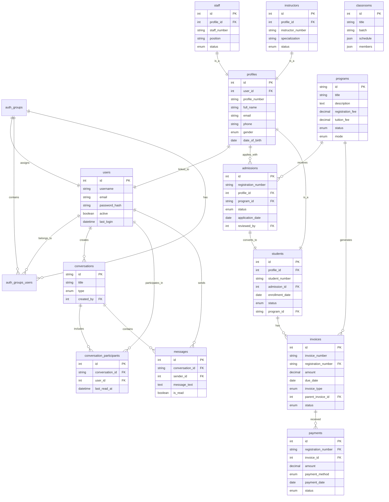
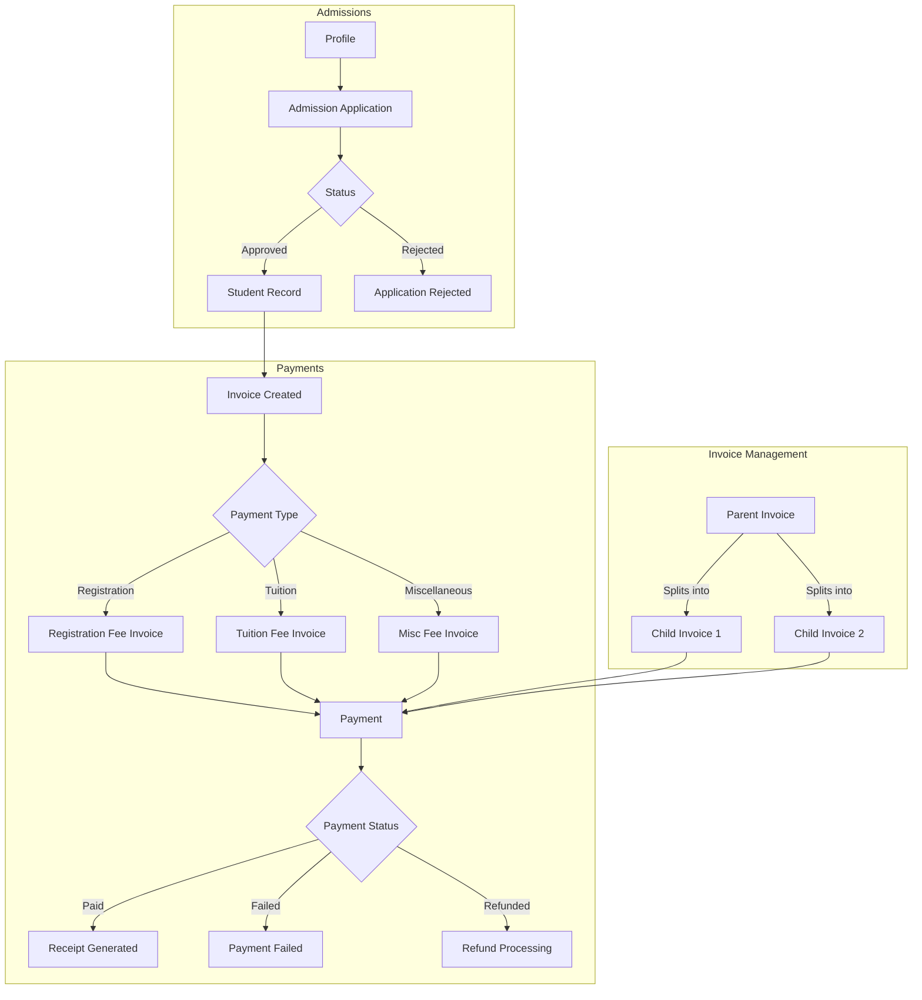
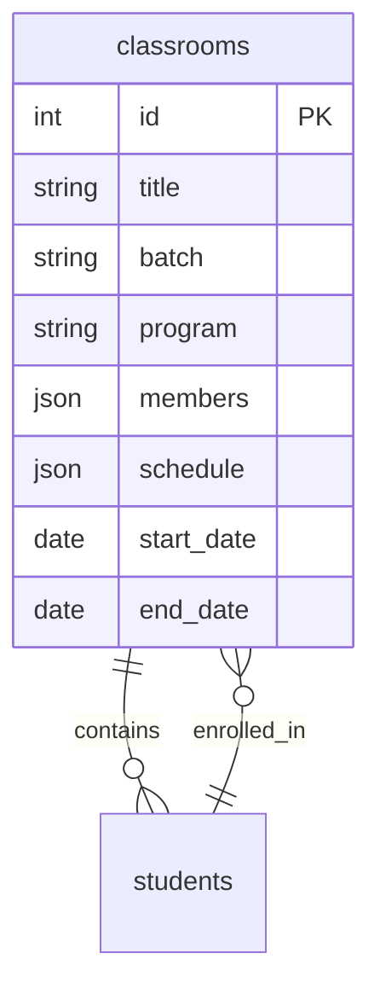

# FEECS Database Entity-Relationship Diagram (ERD)

## Overview

This document describes the complete database structure for the FEECS (Foreign Language Education Center System) application. The application is built with CodeIgniter 4 and uses CodeIgniter Shield for authentication.

## Technology Stack

- **Framework**: CodeIgniter 4
- **Authentication**: CodeIgniter Shield
- **Database**: MySQL/MariaDB
- **ORM**: CodeIgniter Model

---

## Database Tables

### 1. Core Authentication Tables (CodeIgniter Shield)

These tables are provided by CodeIgniter Shield for user authentication and authorization.

#### [`users`](app/Database/Migrations)

| Column           | Type     | Description             |
| ---------------- | -------- | ----------------------- |
| id               | INT      | Primary key             |
| username         | VARCHAR  | Unique username         |
| email            | VARCHAR  | Unique email address    |
| password_hash    | VARCHAR  | Hashed password         |
| reset_hash       | VARCHAR  | Password reset hash     |
| reset_at         | DATETIME | Reset timestamp         |
| activate_hash    | VARCHAR  | Account activation hash |
| status           | VARCHAR  | Account status          |
| status_message   | VARCHAR  | Status message          |
| active           | BOOLEAN  | Is account active       |
| force_pass_reset | BOOLEAN  | Require password reset  |
| permissions      | JSON     | User permissions        |
| last_login       | DATETIME | Last login timestamp    |
| created_at       | DATETIME | Creation timestamp      |
| updated_at       | DATETIME | Update timestamp        |

#### `auth_groups`

| Column      | Type    | Description         |
| ----------- | ------- | ------------------- |
| id          | INT     | Primary key         |
| name        | VARCHAR | Group name (unique) |
| description | VARCHAR | Group description   |

#### `auth_permissions`

| Column      | Type    | Description              |
| ----------- | ------- | ------------------------ |
| id          | INT     | Primary key              |
| name        | VARCHAR | Permission name (unique) |
| description | VARCHAR | Permission description   |

#### `auth_groups_users` (Pivot Table)

| Column  | Type    | Description          |
| ------- | ------- | -------------------- |
| id      | INT     | Primary key          |
| user_id | INT     | Foreign key to users |
| group   | VARCHAR | Group name           |

---

### 2. Profiles Table

Central profile table containing personal information shared across the application.

**Table Name**: [`profiles`](app/Database/Migrations/2026-02-02-042200_CreateProfilesTable.php)

| Column                     | Type                   | Constraints        | Description                                |
| -------------------------- | ---------------------- | ------------------ | ------------------------------------------ |
| id                         | INT                    | PK, AUTO_INCREMENT | Primary key                                |
| profile_number             | VARCHAR(20)            | UNIQUE             | Unique profile identifier (PROF-YYYY-NNNN) |
| user_id                    | INT                    | FK -> users.id     | Associated user account                    |
| full_name                  | VARCHAR(100)           | NOT NULL           | Full name                                  |
| nickname                   | VARCHAR(50)            | NULL               | Preferred name                             |
| gender                     | ENUM('Male', 'Female') | NOT NULL           | Gender                                     |
| place_of_birth             | VARCHAR(100)           | NOT NULL           | Birth place                                |
| date_of_birth              | DATE                   | NOT NULL           | Date of birth                              |
| religion                   | VARCHAR(50)            | NOT NULL           | Religion                                   |
| citizen_id                 | VARCHAR(20)            | NULL               | National ID/KTP number                     |
| phone                      | VARCHAR(15)            | NOT NULL           | Phone number                               |
| email                      | VARCHAR(100)           | UNIQUE             | Email address                              |
| street_address             | TEXT                   | NOT NULL           | Street address                             |
| district                   | VARCHAR(100)           | NOT NULL           | District                                   |
| regency                    | VARCHAR(100)           | NOT NULL           | City/Regency                               |
| province                   | VARCHAR(100)           | NOT NULL           | Province                                   |
| postal_code                | VARCHAR(10)            | NULL               | Postal code                                |
| emergency_contact_name     | VARCHAR(100)           | NOT NULL           | Emergency contact name                     |
| emergency_contact_phone    | VARCHAR(15)            | NOT NULL           | Emergency contact phone                    |
| emergency_contact_relation | VARCHAR(50)            | NOT NULL           | Contact relationship                       |
| father_name                | VARCHAR(100)           | NULL               | Father's name                              |
| mother_name                | VARCHAR(100)           | NULL               | Mother's name                              |
| photo                      | VARCHAR(255)           | NULL               | Profile photo path                         |
| documents                  | JSON                   | NULL               | Uploaded documents                         |
| position                   | VARCHAR(100)           | NULL               | Position/Job title                         |
| created_at                 | DATETIME               | NULL               | Creation timestamp                         |
| updated_at                 | DATETIME               | NULL               | Update timestamp                           |
| deleted_at                 | DATETIME               | NULL               | Soft delete timestamp                      |

**Relationships**:

- One-to-One with [`users`](#1-core-authentication-tables-codeigniter-shield) via `user_id`
- One-to-One with [`students`](#4-students-table) via `profile_id`
- One-to-One with [`staff`](#5-staff-table) via `profile_id`
- One-to-One with [`instructors`](#6-instructors-table) via `profile_id`
- One-to-Many with [`admissions`](#3-admissions-table) via `profile_id`

---

### 3. Admissions Table

Tracks student applications and enrollment requests.

**Table Name**: [`admissions`](app/Database/Migrations/2026-01-30-005313_CreateAdmissionsTable.php)

| Column              | Type                                                 | Constraints                 | Description                     |
| ------------------- | ---------------------------------------------------- | --------------------------- | ------------------------------- |
| id                  | INT                                                  | PK, AUTO_INCREMENT          | Primary key                     |
| registration_number | VARCHAR(20)                                          | UNIQUE                      | Registration ID (REG-YYYY-NNNN) |
| profile_id          | INT                                                  | FK -> profiles.id, NOT NULL | Applicant profile               |
| program_id          | VARCHAR(36)                                          | FK -> programs.id, NOT NULL | Applied program                 |
| status              | ENUM('pending', 'approved', 'rejected', 'withdrawn') | DEFAULT 'pending'           | Application status              |
| application_date    | DATE                                                 | NULL                        | Date of application             |
| reviewed_date       | DATE                                                 | NULL                        | Date reviewed                   |
| reviewed_by         | INT                                                  | FK -> users.id, NULL        | Reviewer user                   |
| notes               | TEXT                                                 | NULL                        | Internal notes                  |
| applicant_notes     | TEXT                                                 | NULL                        | Applicant's notes               |
| created_at          | DATETIME                                             | NULL                        | Creation timestamp              |
| updated_at          | DATETIME                                             | NULL                        | Update timestamp                |
| deleted_at          | DATETIME                                             | NULL                        | Soft delete timestamp           |

**Relationships**:

- Many-to-One with [`profiles`](#2-profiles-table) via `profile_id`
- Many-to-One with [`programs`](#7-programs-table) via `program_id`
- Many-to-One with [`users`](#1-core-authentication-tables-codeigniter-shield) via `reviewed_by`
- One-to-One with [`students`](#4-students-table) via `admission_id`

---

### 4. Students Table

Contains enrolled student records.

**Table Name**: [`students`](app/Database/Migrations/2026-02-03-020815_CreateStudentsTable.php)

| Column          | Type                                                            | Constraints               | Description             |
| --------------- | --------------------------------------------------------------- | ------------------------- | ----------------------- |
| id              | INT                                                             | PK, AUTO_INCREMENT        | Primary key             |
| student_number  | VARCHAR(20)                                                     | UNIQUE                    | Student ID              |
| profile_id      | INT                                                             | FK -> profiles.id, UNIQUE | Student profile         |
| admission_id    | INT                                                             | FK -> admissions.id, NULL | Original admission      |
| enrollment_date | DATE                                                            | NOT NULL                  | Date enrolled           |
| status          | ENUM('active', 'inactive', 'graduated', 'dropped', 'suspended') | DEFAULT 'active'          | Student status          |
| program_id      | VARCHAR(36)                                                     | FK -> programs.id, NULL   | Enrolled program        |
| batch           | VARCHAR(50)                                                     | NULL                      | Batch/group identifier  |
| gpa             | DECIMAL(3,2)                                                    | DEFAULT 0.00              | Grade point average     |
| total_credits   | INT                                                             | DEFAULT 0                 | Total credits earned    |
| graduation_date | DATE                                                            | NULL                      | Date graduated          |
| graduation_gpa  | DECIMAL(3,2)                                                    | NULL                      | Final GPA at graduation |
| created_at      | DATETIME                                                        | NULL                      | Creation timestamp      |
| updated_at      | DATETIME                                                        | NULL                      | Update timestamp        |
| deleted_at      | DATETIME                                                        | NULL                      | Soft delete timestamp   |

**Relationships**:

- One-to-One with [`profiles`](#2-profiles-table) via `profile_id`
- One-to-One with [`admissions`](#3-admissions-table) via `admission_id`
- Many-to-One with [`programs`](#7-programs-table) via `program_id`

---

### 5. Staff Table

Contains administrative staff records.

**Table Name**: [`staff`](app/Database/Migrations/2026-02-03-020850_CreateStaffTable.php)

| Column             | Type                                                 | Constraints               | Description            |
| ------------------ | ---------------------------------------------------- | ------------------------- | ---------------------- |
| id                 | INT                                                  | PK, AUTO_INCREMENT        | Primary key            |
| staff_number       | VARCHAR(20)                                          | UNIQUE                    | Staff identifier       |
| profile_id         | INT                                                  | FK -> profiles.id, UNIQUE | Staff profile          |
| position           | VARCHAR(100)                                         | NOT NULL                  | Job position           |
| department         | VARCHAR(100)                                         | NULL                      | Department             |
| hire_date          | DATE                                                 | NOT NULL                  | Date hired             |
| status             | ENUM('active', 'inactive', 'resigned', 'terminated') | DEFAULT 'active'          | Employment status      |
| employment_type    | ENUM('full-time', 'part-time', 'contract')           | DEFAULT 'full-time'       | Type of employment     |
| salary             | DECIMAL(15,2)                                        | NULL                      | Salary                 |
| termination_date   | DATE                                                 | NULL                      | Date terminated        |
| termination_reason | TEXT                                                 | NULL                      | Reason for termination |
| created_at         | DATETIME                                             | NULL                      | Creation timestamp     |
| updated_at         | DATETIME                                             | NULL                      | Update timestamp       |
| deleted_at         | DATETIME                                             | NULL                      | Soft delete timestamp  |

**Relationships**:

- One-to-One with [`profiles`](#2-profiles-table) via `profile_id`

---

### 6. Instructors Table

Contains teaching staff/instructor records.

**Table Name**: [`instructors`](app/Database/Migrations/2026-02-03-020916_CreateInstructorsTable.php)

| Column            | Type                                   | Constraints               | Description             |
| ----------------- | -------------------------------------- | ------------------------- | ----------------------- |
| id                | INT                                    | PK, AUTO_INCREMENT        | Primary key             |
| instructor_number | VARCHAR(20)                            | UNIQUE                    | Instructor identifier   |
| profile_id        | INT                                    | FK -> profiles.id, UNIQUE | Instructor profile      |
| specialization    | VARCHAR(100)                           | NULL                      | Area of specialization  |
| qualification     | VARCHAR(100)                           | NULL                      | Academic qualification  |
| hire_date         | DATE                                   | NOT NULL                  | Date hired              |
| status            | ENUM('active', 'inactive', 'resigned') | DEFAULT 'active'          | Employment status       |
| max_classes       | INT                                    | DEFAULT 5                 | Maximum classes allowed |
| hourly_rate       | DECIMAL(10,2)                          | NULL                      | Hourly teaching rate    |
| created_at        | DATETIME                               | NULL                      | Creation timestamp      |
| updated_at        | DATETIME                               | NULL                      | Update timestamp        |
| deleted_at        | DATETIME                               | NULL                      | Soft delete timestamp   |

**Relationships**:

- One-to-One with [`profiles`](#2-profiles-table) via `profile_id`

---

### 7. Programs Table

Contains language programs/courses offered by the institution.

**Table Name**: [`programs`](app/Database/Migrations/2026-02-01-104702_CreateProgramsTable.php)

| Column           | Type                                | Constraints       | Description           |
| ---------------- | ----------------------------------- | ----------------- | --------------------- |
| id               | VARCHAR(36)                         | PK                | UUID primary key      |
| title            | VARCHAR(255)                        | NOT NULL          | Program title         |
| description      | TEXT                                | NULL              | Program description   |
| features         | JSON                                | NULL              | Program features      |
| facilities       | JSON                                | NULL              | Available facilities  |
| extra_facilities | JSON                                | NULL              | Additional facilities |
| registration_fee | DECIMAL(10,2)                       | DEFAULT 0.00      | Registration fee      |
| tuition_fee      | DECIMAL(10,2)                       | DEFAULT 0.00      | Tuition fee           |
| discount         | DECIMAL(5,2)                        | DEFAULT 0.00      | Discount percentage   |
| category         | VARCHAR(100)                        | NULL              | Program category      |
| sub_category     | VARCHAR(100)                        | NULL              | Program subcategory   |
| status           | ENUM('active', 'inactive')          | DEFAULT 'active'  | Program status        |
| mode             | ENUM('online', 'offline', 'hybrid') | DEFAULT 'offline' | Delivery mode         |
| duration         | VARCHAR(100)                        | NULL              | Program duration      |
| thumbnail        | VARCHAR(255)                        | NULL              | Thumbnail image path  |
| created_at       | TIMESTAMP                           | NULL              | Creation timestamp    |
| updated_at       | TIMESTAMP                           | NULL              | Update timestamp      |
| deleted_at       | TIMESTAMP                           | NULL              | Soft delete timestamp |

**Relationships**:

- One-to-Many with [`admissions`](#3-admissions-table) via `program_id`
- One-to-Many with [`students`](#4-students-table) via `program_id`
- One-to-Many with [`invoices`](#8-invoices-table) via `program_id`

---

### 8. Invoices Table

Financial invoices for payments.

**Table Name**: [`invoices`](app/Database/Migrations/2026-02-01-000001_CreateInvoicesTable.php)

| Column              | Type                                                             | Constraints                          | Description                 |
| ------------------- | ---------------------------------------------------------------- | ------------------------------------ | --------------------------- |
| id                  | INT                                                              | PK, AUTO_INCREMENT                   | Primary key                 |
| invoice_number      | VARCHAR(50)                                                      | UNIQUE                               | Invoice number              |
| registration_number | VARCHAR(20)                                                      | FK -> admissions.registration_number | Student registration        |
| description         | TEXT                                                             | NULL                                 | Invoice description         |
| amount              | DECIMAL(10,2)                                                    | NOT NULL                             | Invoice amount              |
| due_date            | DATE                                                             | NOT NULL                             | Payment due date            |
| invoice_type        | ENUM('registration_fee', 'tuition_fee', 'miscellaneous_fee')     | NOT NULL                             | Type of invoice             |
| parent_invoice_id   | INT                                                              | FK -> invoices.id, NULL              | Parent invoice (for splits) |
| status              | ENUM('unpaid', 'paid', 'cancelled', 'expired', 'partially_paid') | DEFAULT 'unpaid'                     | Payment status              |
| items               | JSON                                                             | NULL                                 | Invoice line items          |
| created_at          | DATETIME                                                         | NULL                                 | Creation timestamp          |
| updated_at          | DATETIME                                                         | NULL                                 | Update timestamp            |
| deleted_at          | DATETIME                                                         | NULL                                 | Soft delete timestamp       |

**Relationships**:

- Many-to-One with [`admissions`](#3-admissions-table) via `registration_number`
- One-to-Many with [`payments`](#9-payments-table) via `invoice_id`
- Self-referential One-to-Many via `parent_invoice_id` (invoice splitting)

#### Invoice Line Items Structure (JSON)

The `items` JSON field stores line items for detailed invoice breakdown. When an admission is approved, the system automatically generates an initial invoice with two standard items:

| Field       | Type          | Description                       |
| ----------- | ------------- | --------------------------------- |
| description | STRING        | Item description                  |
| quantity    | INT           | Quantity (always 1 for fee items) |
| unit_price  | DECIMAL(10,2) | Unit price                        |
| subtotal    | DECIMAL(10,2) | Line subtotal                     |

**Example: Admission Auto-Generated Invoice Items**

```json
[
  {
    "description": "Registration Fee",
    "quantity": 1,
    "unit_price": 150000.0,
    "subtotal": 150000.0
  },
  {
    "description": "English Course - Beginner Level",
    "quantity": 1,
    "unit_price": 2500000.0,
    "subtotal": 2500000.0
  }
]
```

**Total Calculation**: Sum of all item subtotals = Registration Fee + Tuition Fee

---

### 9. Payments Table

Records of payments made against invoices.

**Table Name**: [`payments`](app/Database/Migrations/2026-02-01-000002_CreatePaymentsTable.php)

| Column              | Type                                          | Constraints                          | Description           |
| ------------------- | --------------------------------------------- | ------------------------------------ | --------------------- |
| id                  | INT                                           | PK, AUTO_INCREMENT                   | Primary key           |
| registration_number | VARCHAR(20)                                   | FK -> admissions.registration_number | Student registration  |
| invoice_id          | INT                                           | FK -> invoices.id, NULL              | Associated invoice    |
| amount              | DECIMAL(10,2)                                 | NOT NULL                             | Payment amount        |
| payment_method      | ENUM('cash', 'bank_transfer')                 | NOT NULL                             | Payment method        |
| document_number     | VARCHAR(100)                                  | NULL                                 | Transaction reference |
| payment_date        | DATE                                          | NOT NULL                             | Date of payment       |
| receipt_file        | VARCHAR(255)                                  | NULL                                 | Receipt file path     |
| status              | ENUM('pending', 'paid', 'failed', 'refunded') | DEFAULT 'pending'                    | Payment status        |
| failure_reason      | TEXT                                          | NULL                                 | Failure details       |
| refund_date         | DATE                                          | NULL                                 | Date refunded         |
| refund_reason       | TEXT                                          | NULL                                 | Refund reason         |
| notes               | TEXT                                          | NULL                                 | Additional notes      |
| created_at          | DATETIME                                      | NULL                                 | Creation timestamp    |
| updated_at          | DATETIME                                      | NULL                                 | Update timestamp      |
| deleted_at          | DATETIME                                      | NULL                                 | Soft delete timestamp |

**Relationships**:

- Many-to-One with [`admissions`](#3-admissions-table) via `registration_number`
- Many-to-One with [`invoices`](#8-invoices-table) via `invoice_id`

---

### 10. Classrooms Table

Classroom/class group management.

**Table Name**: [`classrooms`](app/Database/Migrations/2026-02-05-024350_CreateClassroomsTable.php)

| Column     | Type         | Constraints        | Description              |
| ---------- | ------------ | ------------------ | ------------------------ |
| id         | INT          | PK, AUTO_INCREMENT | Primary key              |
| title      | VARCHAR(255) | NOT NULL           | Classroom name           |
| batch      | VARCHAR(50)  | NULL               | Batch identifier         |
| grade      | VARCHAR(50)  | NULL               | Grade level              |
| program    | VARCHAR(255) | NULL               | Program name             |
| status     | VARCHAR(20)  | DEFAULT 'active'   | Classroom status         |
| start_date | DATE         | NULL               | Start date               |
| end_date   | DATE         | NULL               | End date                 |
| schedule   | JSON         | NULL               | Weekly schedule          |
| members    | JSON         | NULL               | Class members (students) |
| created_at | DATETIME     | NULL               | Creation timestamp       |
| updated_at | DATETIME     | NULL               | Update timestamp         |
| deleted_at | DATETIME     | NULL               | Soft delete timestamp    |

**Note**: This table uses JSON fields for flexible member and schedule management.

---

### 11. Conversations Table

Messaging conversations.

**Table Name**: [`conversations`](app/Database/Migrations/2026-02-05-130000_CreateConversationsTable.php)

| Column     | Type                     | Constraints       | Description           |
| ---------- | ------------------------ | ----------------- | --------------------- |
| id         | VARCHAR(36)              | PK                | UUID primary key      |
| title      | VARCHAR(255)             | NULL              | Conversation title    |
| type       | ENUM('private', 'group') | DEFAULT 'private' | Conversation type     |
| created_by | INT                      | FK -> users.id    | Creator user          |
| created_at | DATETIME                 | NULL              | Creation timestamp    |
| updated_at | DATETIME                 | NULL              | Update timestamp      |
| deleted_at | DATETIME                 | NULL              | Soft delete timestamp |

**Relationships**:

- Many-to-One with [`users`](#1-core-authentication-tables-codeigniter-shield) via `created_by`
- One-to-Many with [`messages`](#12-messages-table) via `conversation_id`
- One-to-Many with [`conversation_participants`](#13-conversation-participants-table) via `conversation_id`

---

### 12. Messages Table

Individual messages within conversations.

**Table Name**: [`messages`](app/Database/Migrations/2026-02-05-130001_CreateMessagesTable.php)

| Column          | Type         | Constraints            | Description           |
| --------------- | ------------ | ---------------------- | --------------------- |
| id              | INT          | PK, AUTO_INCREMENT     | Primary key           |
| conversation_id | VARCHAR(36)  | FK -> conversations.id | Parent conversation   |
| sender_id       | INT          | FK -> users.id         | Message sender        |
| message_text    | TEXT         | NULL                   | Message content       |
| attachment_path | VARCHAR(255) | NULL                   | File attachment path  |
| is_read         | BOOLEAN      | DEFAULT FALSE          | Read status           |
| created_at      | DATETIME     | NULL                   | Creation timestamp    |
| updated_at      | DATETIME     | NULL                   | Update timestamp      |
| deleted_at      | DATETIME     | NULL                   | Soft delete timestamp |

**Relationships**:

- Many-to-One with [`conversations`](#11-conversations-table) via `conversation_id`
- Many-to-One with [`users`](#1-core-authentication-tables-codeigniter-shield) via `sender_id`

---

### 13. Conversation Participants Table

Junction table for user participation in conversations.

**Table Name**: [`conversation_participants`](app/Database/Migrations/2026-02-05-130002_CreateConversationParticipantsTable.php)

| Column          | Type        | Constraints            | Description         |
| --------------- | ----------- | ---------------------- | ------------------- |
| id              | INT         | PK, AUTO_INCREMENT     | Primary key         |
| conversation_id | VARCHAR(36) | FK -> conversations.id | Conversation        |
| user_id         | INT         | FK -> users.id         | Participant user    |
| joined_at       | DATETIME    | NULL                   | Join timestamp      |
| last_read_at    | DATETIME    | NULL                   | Last read timestamp |

**Relationships**:

- Many-to-One with [`conversations`](#11-conversations-table) via `conversation_id`
- Many-to-One with [`users`](#1-core-authentication-tables-codeigniter-shield) via `user_id`
- Unique constraint on `(conversation_id, user_id)`

---

## ERD Diagrams

### Main Entity-Relationship Diagram



### Financial Flow Diagram



### User-Role Relationship Diagram

```mermaid
erDiagram
    users ||--o{ profiles : "has_one"
    users ||--o{ auth_groups_users : "assigned_to"
    users ||--o{ conversation_participants : "participates"
    users ||--o{ messages : "sends"
    users ||--o{ conversations : "creates"

    profiles ||--|| students : "becomes"
    profiles ||--|| staff : "becomes"
    profiles ||--|| instructors : "becomes"

    auth_groups ||--o{ auth_groups_users : "contains"

    auth_groups {
        superadmin "Super Admin"
        admin "Admin"
        frontline "Frontline Admin"
        finance "Finance Admin"
        instructor "Instructor"
        student "Student"
        staff "Staff"
    }
```

### Classroom Structure Diagram



---

## Database Indexes

| Table                     | Index Type | Columns                            |
| ------------------------- | ---------- | ---------------------------------- |
| admissions                | UNIQUE     | registration_number                |
| admissions                | UNIQUE     | profile_id, program_id, deleted_at |
| admissions                | KEY        | profile_id                         |
| admissions                | KEY        | program_id                         |
| admissions                | KEY        | reviewed_by                        |
| auth_groups_users         | UNIQUE     | user_id, group                     |
| classrooms                | PRIMARY    | id                                 |
| conversation_participants | PRIMARY    | id                                 |
| conversation_participants | UNIQUE     | conversation_id, user_id           |
| conversations             | PRIMARY    | id                                 |
| invoices                  | UNIQUE     | invoice_number                     |
| invoices                  | KEY        | registration_number                |
| invoices                  | KEY        | status                             |
| invoices                  | KEY        | due_date                           |
| invoices                  | KEY        | parent_invoice_id                  |
| messages                  | PRIMARY    | id                                 |
| payments                  | KEY        | registration_number                |
| payments                  | KEY        | payment_date                       |
| payments                  | KEY        | status                             |
| payments                  | KEY        | payment_method                     |
| profiles                  | UNIQUE     | profile_number                     |
| profiles                  | UNIQUE     | email                              |
| profiles                  | KEY        | user_id                            |
| programs                  | PRIMARY    | id                                 |
| programs                  | KEY        | status                             |
| programs                  | KEY        | category                           |
| programs                  | KEY        | deleted_at                         |
| students                  | UNIQUE     | student_number                     |
| students                  | UNIQUE     | profile_id                         |
| students                  | KEY        | admission_id                       |
| students                  | KEY        | status                             |
| staff                     | UNIQUE     | staff_number                       |
| staff                     | UNIQUE     | profile_id                         |
| instructors               | UNIQUE     | instructor_number                  |
| instructors               | UNIQUE     | profile_id                         |

---

## Foreign Key Constraints

| Child Table               | Foreign Key         | Parent Table  | On Delete | On Update |
| ------------------------- | ------------------- | ------------- | --------- | --------- |
| admissions                | profile_id          | profiles      | CASCADE   | CASCADE   |
| admissions                | program_id          | programs      | RESTRICT  | CASCADE   |
| admissions                | reviewed_by         | users         | SET NULL  | CASCADE   |
| auth_groups_users         | user_id             | users         | CASCADE   | CASCADE   |
| conversation_participants | conversation_id     | conversations | CASCADE   | CASCADE   |
| conversation_participants | user_id             | users         | CASCADE   | CASCADE   |
| conversations             | created_by          | users         | CASCADE   | CASCADE   |
| invoices                  | registration_number | admissions    | CASCADE   | CASCADE   |
| invoices                  | parent_invoice_id   | invoices      | SET NULL  | CASCADE   |
| messages                  | conversation_id     | conversations | CASCADE   | CASCADE   |
| messages                  | sender_id           | users         | CASCADE   | CASCADE   |
| payments                  | registration_number | admissions    | CASCADE   | CASCADE   |
| payments                  | invoice_id          | invoices      | SET NULL  | CASCADE   |
| profiles                  | user_id             | users         | CASCADE   | CASCADE   |
| students                  | profile_id          | profiles      | CASCADE   | CASCADE   |
| students                  | admission_id        | admissions    | SET NULL  | CASCADE   |
| students                  | program_id          | programs      | SET NULL  | CASCADE   |
| staff                     | profile_id          | profiles      | CASCADE   | CASCADE   |
| instructors               | profile_id          | profiles      | CASCADE   | CASCADE   |

---

## Key Design Patterns

### 1. Profile-Centric Design

All personal information is stored in the `profiles` table, which is then linked to specific roles (students, staff, instructors). This follows the **Party Pattern** where a single profile can have multiple roles.

### 2. Soft Deletes

All business tables use soft deletes via the `deleted_at` timestamp field, allowing for data recovery and audit trails.

### 3. Timestamp Tracking

Tables include `created_at` and `updated_at` fields for audit purposes.

### 4. JSON Fields for Flexibility

- `programs.features`, `programs.facilities`, `programs.extra_facilities`
- `classrooms.schedule`, `classrooms.members`
- `invoices.items`

### 5. Invoice Hierarchy

The `parent_invoice_id` allows for splitting invoices into multiple child invoices while maintaining a relationship to the original.

---

## Summary Statistics

| Category                 | Count                       |
| ------------------------ | --------------------------- |
| Total Tables             | 14                          |
| Authentication Tables    | 4                           |
| Business Tables          | 10                          |
| Junction Tables          | 2                           |
| Tables with Soft Deletes | 13                          |
| Tables using UUID PK     | 2 (programs, conversations) |

---

## Revision History

| Version | Date       | Description               |
| ------- | ---------- | ------------------------- |
| 1.0     | 2026-02-12 | Initial ERD documentation |
