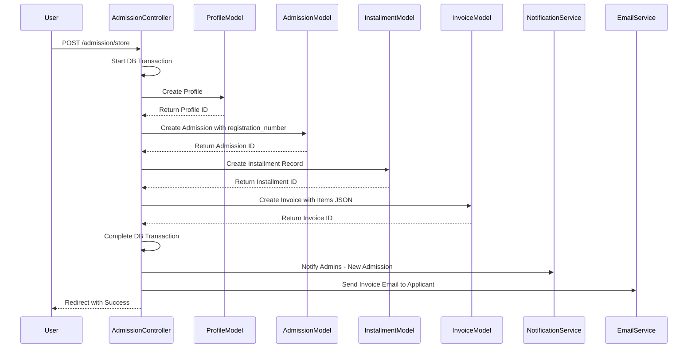
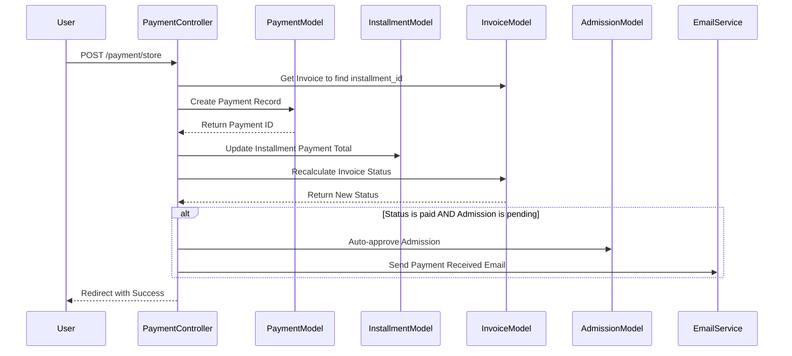

# Test Sequences Implementation Plan - Elaborated

## Overview

Create test sequences in the Settings module to simulate:

1. **Admission Process** - Generate N dummy admissions with full flow (profile, admission, installment, invoice, notification)
2. **Payment Process** - Generate payments for all existing unpaid/partially_paid invoices

---

## Current State Analysis

### Existing Admission Flow (from [`AdmissionController::store()`](app/Modules/Admission/Controllers/AdmissionController.php:146))

The admission creation process follows this sequence:



#### Key Implementation Details

1. **Profile Creation** (lines 165-175):
   - Uses [`ProfileModel`](app/Modules/Account/Models/ProfileModel.php:7)
   - Required fields: `full_name`, `email`, `gender`, `place_of_birth`, `date_of_birth`, `religion`, `phone`, `street_address`, `district`, `regency`, `province`
   - Auto-generates `profile_number` format: `PROF-YYYY-NNNN`

2. **Admission Creation** (lines 185-203):
   - Uses [`AdmissionModel`](app/Modules/Admission/Models/AdmissionModel.php)
   - Auto-generates `registration_number` format: `REG-YYYY-XXXXX`
   - Links to `profile_id` and `program_id`
   - Default status: `pending`

3. **Installment Creation** (lines 205-224):
   - Uses [`InstallmentModel`](app/Modules/Payment/Models/InstallmentModel.php:7)
   - Calculates `total_contract_amount` = registration_fee + tuition_fee
   - Sets `due_date` to +2 weeks from creation
   - Status: `unpaid`

4. **Invoice Creation** (lines 228-265):
   - Uses [`InvoiceModel`](app/Modules/Payment/Models/InvoiceModel.php:7)
   - Creates items JSON with 2 entries:
     - Registration Fee item
     - Tuition Fee item
   - Auto-generates `invoice_number` format: `INV-YYYYMMDD-HHMMSS-ID`
   - Status: `unpaid`

5. **Notification** (lines 273-280):
   - Uses `NotificationService::notifyNewAdmission()`
   - Notifies admins about new application

6. **Email** (lines 282-308):
   - Uses `EmailService::sendInvoiceNotification()`
   - Sends invoice details to applicant email

### Existing Payment Flow (from [`PaymentController::store()`](app/Modules/Payment/Controllers/PaymentController.php:146))



#### Key Implementation Details

1. **Payment Creation** (lines 159-179):
   - Uses `PaymentModel`
   - Links to `invoice_id` and `installment_id`
   - Handles receipt file upload
   - Default status: `pending`

2. **Installment Update** (lines 183-186):
   - Calls [`InstallmentModel::updatePaymentTotal()`](app/Modules/Payment/Models/InstallmentModel.php:93)
   - Recalculates `total_paid`, `remaining_balance`, `status`

3. **Invoice Status Recalculation** (lines 188-190):
   - Calls [`InvoiceModel::recalculateInvoiceStatus()`](app/Modules/Payment/Models/InvoiceModel.php)
   - Updates invoice status based on total payments

4. **Auto-approve Admission** (lines 192-217):
   - If payment status is `paid` and admission is `pending`
   - Updates admission status to `approved`
   - Sets `reviewed_date` to current timestamp
   - Adds note about auto-approval
   - Sends payment received email to applicant

---

## Implementation Plan

### 1. Update [`SettingsController`](app/Modules/Settings/Controllers/SettingsController.php:7)

#### generateTestAdmissions() Method

```php
private function generateTestAdmissions(int $count = 10): array
{
    // 1. Get active programs
    $programModel = new \Modules\Program\Models\ProgramModel();
    $programs = $programModel->where('status', 'active')->findAll();

    if (empty($programs)) {
        throw new Exception('No active programs found. Please seed programs first.');
    }

    // 2. Dummy data pools
    $firstNames = ['Ahmad', 'Siti', 'Budi', 'Dewi', 'Eko', 'Fitri', 'Gunawan', 'Hesti', 'Irfan', 'Julia', 'Krisna', 'Linda', 'Muhammad', 'Nadia', 'Oscar'];
    $lastNames = ['Rizki', 'Nurhaliza', 'Santoso', 'Lestari', 'Prasetyo', 'Handayani', 'Wibowo', 'Rahayu', 'Hakim', 'Permata', 'Murti', 'Sari', 'Fadli', 'Putri', 'Wijaya'];
    $cities = ['Jakarta', 'Surabaya', 'Bandung', 'Semarang', 'Yogyakarta', 'Malang', 'Medan', 'Makassar', 'Pare', 'Kediri', 'Blitar', 'Jember', 'Banyuwangi', 'Probolinggo', 'Pasuruan'];
    $religions = ['Islam', 'Kristen', 'Katolik', 'Hindu', 'Buddha', 'Konghucu'];
    $provinces = ['Jawa Timur', 'Jawa Barat', 'Jawa Tengah', 'DKI Jakarta', 'DI Yogyakarta', 'Bali', 'Sumatera Utara', 'Sulawesi Selatan'];

    $db = \Config\Database::connect();
    $db->transStart();

    $created = [
        'profiles' => 0,
        'admissions' => 0,
        'installments' => 0,
        'invoices' => 0,
        'notifications' => 0
    ];

    try {
        foreach (range(1, $count) as $i) {
            // Randomly select program
            $program = $programs[array_rand($programs)];

            // Generate unique data
            $firstName = $firstNames[array_rand($firstNames)];
            $lastName = $lastNames[array_rand($lastNames)];
            $fullName = "$firstName $lastName";
            $email = "test{$i}_" . time() . "@example.com";
            $phone = '08' . rand(1000000000, 9999999999);
            $city = $cities[array_rand($cities)];
            $province = $provinces[array_rand($provinces)];

            // 1. Create Profile
            $profileModel = new \Modules\Account\Models\ProfileModel();
            $profileData = [
                'full_name' => $fullName,
                'nickname' => $firstName,
                'gender' => rand(0, 1) ? 'Male' : 'Female',
                'email' => $email,
                'phone' => $phone,
                'place_of_birth' => $city,
                'date_of_birth' => date('Y-m-d', strtotime('-' . rand(18, 30) . ' years')),
                'religion' => $religions[array_rand($religions)],
                'street_address' => "Jl. " . $firstName . " No. " . rand(1, 100),
                'district' => 'Kecamatan ' . $city,
                'regency' => 'Kota ' . $city,
                'province' => $province,
                'postal_code' => (string)rand(10000, 99999)
            ];

            if (!$profileModel->insert($profileData)) {
                throw new Exception('Failed to create profile: ' . json_encode($profileModel->errors()));
            }
            $profileId = $profileModel->insertID();
            $created['profiles']++;

            // 2. Generate registration number
            $year = date('Y');
            $lastReg = $db->table('admissions')
                ->like('registration_number', "REG-{$year}-")
                ->orderBy('id', 'DESC')
                ->get()
                ->getRowArray();
            $regNum = $lastReg ? (int)substr($lastReg['registration_number'], -5) + 1 : 1;
            $registrationNumber = sprintf("REG-%s-%05d", $year, $regNum);

            // 3. Create Admission
            $admissionModel = new \Modules\Admission\Models\AdmissionModel();
            $admissionData = [
                'profile_id' => $profileId,
                'program_id' => $program['id'],
                'registration_number' => $registrationNumber,
                'status' => 'pending',
                'application_date' => date('Y-m-d H:i:s', strtotime('-' . rand(1, 30) . ' days')),
                'source' => 'test_data'
            ];

            if (!$admissionModel->insert($admissionData)) {
                throw new Exception('Failed to create admission: ' . json_encode($admissionModel->errors()));
            }
            $created['admissions']++;

            // 4. Create Installment
            $regFee = (float)($program['registration_fee'] ?? 0);
            $tuitionFee = (float)($program['tuition_fee'] ?? 0);
            $totalAmount = $regFee + $tuitionFee;
            $dueDate = date('Y-m-d', strtotime('+2 weeks'));

            $installmentModel = new \Modules\Payment\Models\InstallmentModel();
            $installmentData = [
                'registration_number' => $registrationNumber,
                'total_contract_amount' => $totalAmount,
                'total_paid' => 0,
                'remaining_balance' => $totalAmount,
                'status' => 'unpaid',
                'due_date' => $dueDate
            ];

            if (!$installmentModel->createInstallment($installmentData)) {
                throw new Exception('Failed to create installment: ' . json_encode($installmentModel->errors()));
            }
            $installmentId = $installmentModel->insertID();
            $created['installments']++;

            // 5. Create Invoice
            if ($totalAmount > 0) {
                $invoiceModel = new \Modules\Payment\Models\InvoiceModel();
                $items = [
                    [
                        'description' => 'Biaya Pendaftaran Program ' . $program['title'],
                        'amount' => $regFee,
                        'type' => 'registration_fee'
                    ],
                    [
                        'description' => 'Biaya Kursus ' . $program['title'],
                        'amount' => $tuitionFee,
                        'type' => 'tuition_fee'
                    ]
                ];

                $invoiceData = [
                    'registration_number' => $registrationNumber,
                    'contract_number' => $registrationNumber,
                    'installment_id' => $installmentId,
                    'description' => 'Payment for ' . $program['title'] . ' Program',
                    'amount' => $totalAmount,
                    'due_date' => $dueDate,
                    'invoice_type' => 'tuition_fee',
                    'status' => 'unpaid',
                    'items' => json_encode($items, JSON_UNESCAPED_UNICODE)
                ];

                if (!$invoiceModel->createInvoice($invoiceData)) {
                    throw new Exception('Failed to create invoice: ' . json_encode($invoiceModel->errors()));
                }
                $created['invoices']++;
            }

            // 6. Create Notification (optional - skip for test data to avoid spamming)
            // $notificationService = new \App\Services\NotificationService();
            // $notificationService->notifyNewAdmission([...]);
            // $created['notifications']++;
        }

        $db->transComplete();

        if ($db->transStatus() === false) {
            throw new Exception('Database transaction failed');
        }

        return $created;

    } catch (Exception $e) {
        $db->transRollback();
        throw $e;
    }
}
```

#### generateTestPayments() Method

```php
private function generateTestPayments(): array
{
    $invoiceModel = new \Modules\Payment\Models\InvoiceModel();
    $paymentModel = new \Modules\Payment\Models\PaymentModel();
    $installmentModel = new \Modules\Payment\Models\InstallmentModel();
    $admissionModel = new \Modules\Admission\Models\AdmissionModel();
    $profileModel = new \Modules\Account\Models\ProfileModel();

    // Get all unpaid/partially_paid invoices
    $invoices = $invoiceModel->whereIn('status', ['unpaid', 'partially_paid'])->findAll();

    if (empty($invoices)) {
        throw new Exception('No unpaid invoices found. Generate test admissions first.');
    }

    $paymentMethods = ['cash', 'bank_transfer', 'e_wallet', 'credit_card'];
    $db = \Config\Database::connect();

    $created = [
        'payments' => 0,
        'invoices_updated' => 0,
        'admissions_approved' => 0
    ];

    foreach ($invoices as $invoice) {
        $db->transStart();

        try {
            $installment = $installmentModel->find($invoice['installment_id']);
            $remainingBalance = $installment ? (float)$installment['remaining_balance'] : (float)$invoice['amount'];

            if ($remainingBalance <= 0) {
                continue;
            }

            // Random: full payment (70%) or partial payment (30%)
            $isFullPayment = rand(1, 10) <= 7;

            if ($isFullPayment) {
                $paymentAmount = $remainingBalance;
            } else {
                // Partial: 30-70% of remaining
                $paymentAmount = $remainingBalance * (rand(30, 70) / 100);
            }

            // Create payment
            $paymentData = [
                'registration_number' => $invoice['registration_number'],
                'invoice_id' => $invoice['id'],
                'installment_id' => $invoice['installment_id'],
                'amount' => $paymentAmount,
                'payment_method' => $paymentMethods[array_rand($paymentMethods)],
                'document_number' => 'DOC-' . date('Ymd') . '-' . str_pad(rand(1, 9999), 4, '0', STR_PAD_LEFT),
                'payment_date' => date('Y-m-d H:i:s'),
                'status' => 'paid', // Auto-approve test payments
                'notes' => 'Test payment - ' . ($isFullPayment ? 'Full' : 'Partial') . ' payment'
            ];

            if (!$paymentModel->insert($paymentData)) {
                throw new Exception('Failed to create payment: ' . json_encode($paymentModel->errors()));
            }
            $created['payments']++;

            // Update installment totals
            if ($invoice['installment_id']) {
                $installmentModel->updatePaymentTotal($invoice['installment_id']);
            }

            // Recalculate invoice status
            $newStatus = $invoiceModel->recalculateInvoiceStatus($invoice['id']);
            $created['invoices_updated']++;

            // Auto-approve admission if pending
            $admission = $admissionModel->where('registration_number', $invoice['registration_number'])->first();
            if ($admission && $admission['status'] === 'pending') {
                $admissionModel->update($admission['id'], [
                    'status' => 'approved',
                    'reviewed_date' => date('Y-m-d H:i:s'),
                    'notes' => ($admission['notes'] ?? '') . "\n[" . date('Y-m-d H:i:s') . "] Auto-approved via test payment."
                ]);
                $created['admissions_approved']++;
            }

            $db->transComplete();

        } catch (Exception $e) {
            $db->transRollback();
            log_message('error', 'Test payment generation failed for invoice ' . $invoice['id'] . ': ' . $e->getMessage());
        }
    }

    return $created;
}
```

### 2. Update generateTestData() Method

```php
public function generateTestData()
{
    $type = $this->request->getPost('type');
    $count = (int)$this->request->getPost('count') ?: 10;

    try {
        $result = [];

        switch ($type) {
            case 'admissions':
                $result = $this->generateTestAdmissions($count);
                $message = "Generated: {$result['profiles']} profiles, {$result['admissions']} admissions, {$result['installments']} installments, {$result['invoices']} invoices";
                break;

            case 'payments':
                $result = $this->generateTestPayments();
                $message = "Generated: {$result['payments']} payments, updated {$result['invoices_updated']} invoices, approved {$result['admissions_approved']} admissions";
                break;

            case 'invoices':
                throw new Exception('Standalone invoice generation is deprecated. Use admissions to generate invoices.');

            default:
                throw new Exception('Unknown test data type: ' . $type);
        }

        return redirect()->to('settings/test-data')
            ->with('success', $message)
            ->with('result', $result);

    } catch (Exception $e) {
        return redirect()->to('settings/test-data')
            ->with('error', 'Failed to generate test data: ' . $e->getMessage());
    }
}
```

---

### 3. UI Updates for [`test_data.php`](app/Modules/Settings/Views/test_data.php)

Add the following enhancements:

```php
<!-- Add after success/error messages -->

<?php if (session('result')): ?>
<div class="card mb-4">
    <div class="card-header bg-success text-white">
        <i class="bi bi-check-circle me-2"></i>Generation Summary
    </div>
    <div class="card-body">
        <ul class="list-group list-group-flush">
            <?php foreach (session('result') as $key => $value): ?>
            <li class="list-group-item d-flex justify-content-between">
                <span><?= ucfirst(str_replace('_', ' ', $key)) ?></span>
                <strong><?= $value ?></strong>
            </li>
            <?php endforeach ?>
        </ul>
        <div class="mt-3">
            <a href="<?= base_url('admission') ?>" class="btn btn-outline-primary btn-sm">
                <i class="bi bi-eye me-1"></i>View Admissions
            </a>
            <a href="<?= base_url('payment') ?>" class="btn btn-outline-success btn-sm">
                <i class="bi bi-eye me-1"></i>View Payments
            </a>
        </div>
    </div>
</div>
<?php endif ?>

<!-- Add Quick Actions Card -->
<div class="card mt-4">
    <div class="card-header">
        <i class="bi bi-lightning me-2"></i>Quick Actions
    </div>
    <div class="card-body">
        <form method="post" action="<?= base_url('settings/generate-test-data') ?>" class="d-inline">
            <input type="hidden" name="type" value="admissions">
            <input type="hidden" name="count" value="10">
            <button type="submit" class="btn btn-outline-primary btn-sm">
                <i class="bi bi-plus me-1"></i>Quick: 10 Admissions
            </button>
        </form>
        <form method="post" action="<?= base_url('settings/generate-test-data') ?>" class="d-inline ms-2">
            <input type="hidden" name="type" value="payments">
            <button type="submit" class="btn btn-outline-success btn-sm">
                <i class="bi bi-cash me-1"></i>Pay All Invoices
            </button>
        </form>
        <a href="<?= base_url('settings/cleanup') ?>" class="btn btn-outline-danger btn-sm ms-2">
            <i class="bi bi-trash me-1"></i>Cleanup All Data
        </a>
    </div>
</div>
```

---

## Data Model Reference

### Profile Fields

| Field            | Type   | Required | Test Data Generation             |
| ---------------- | ------ | -------- | -------------------------------- |
| `profile_number` | string | auto     | Auto-generated: `PROF-YYYY-NNNN` |
| `full_name`      | string | yes      | From dummy names pool            |
| `nickname`       | string | no       | First name only                  |
| `gender`         | enum   | yes      | Random: Male/Female              |
| `email`          | string | yes      | `test{i}@example.com`            |
| `phone`          | string | yes      | Random Indonesian mobile         |
| `place_of_birth` | string | yes      | Major Indonesian cities          |
| `date_of_birth`  | date   | yes      | Random (18-30 years old)         |
| `religion`       | string | yes      | Indonesian religions             |
| `street_address` | text   | yes      | Random address                   |
| `district`       | string | yes      | Random kecamatan                 |
| `regency`        | string | yes      | Random kota/kabupaten            |
| `province`       | string | yes      | Indonesian provinces             |
| `postal_code`    | string | no       | Random 5 digits                  |

### Admission Fields

| Field                 | Type     | Required | Test Data Generation             |
| --------------------- | -------- | -------- | -------------------------------- |
| `registration_number` | string   | auto     | Auto-generated: `REG-YYYY-XXXXX` |
| `profile_id`          | int      | yes      | From created profile             |
| `program_id`          | int      | yes      | Random from active programs      |
| `status`              | enum     | yes      | `pending`                        |
| `application_date`    | datetime | yes      | Recent random date               |
| `source`              | string   | no       | `test_data`                      |

### Installment Fields

| Field                   | Type    | Required | Test Data Generation |
| ----------------------- | ------- | -------- | -------------------- |
| `registration_number`   | string  | yes      | From admission       |
| `total_contract_amount` | decimal | yes      | Program fees total   |
| `total_paid`            | decimal | yes      | 0 initially          |
| `remaining_balance`     | decimal | yes      | Same as total        |
| `status`                | enum    | yes      | `unpaid`             |
| `due_date`              | date    | yes      | +2 weeks             |

### Invoice Fields

| Field                 | Type    | Required | Test Data Generation |
| --------------------- | ------- | -------- | -------------------- |
| `invoice_number`      | string  | auto     | Auto-generated       |
| `registration_number` | string  | yes      | From admission       |
| `installment_id`      | int     | yes      | From installment     |
| `description`         | string  | yes      | Program description  |
| `amount`              | decimal | yes      | Total fees           |
| `due_date`            | date    | yes      | From installment     |
| `invoice_type`        | enum    | yes      | `tuition_fee`        |
| `status`              | enum    | yes      | `unpaid`             |
| `items`               | json    | no       | Fee breakdown        |

### Payment Fields

| Field                 | Type     | Required | Test Data Generation     |
| --------------------- | -------- | -------- | ------------------------ |
| `registration_number` | string   | yes      | From invoice             |
| `invoice_id`          | int      | yes      | From invoice             |
| `installment_id`      | int      | yes      | From invoice             |
| `amount`              | decimal  | yes      | Random (full or partial) |
| `payment_method`      | enum     | yes      | Random from list         |
| `document_number`     | string   | no       | Auto-generated           |
| `payment_date`        | datetime | yes      | Current time             |
| `status`              | enum     | yes      | `paid`                   |
| `notes`               | text     | no       | Test payment note        |

---

## Routes Reference

Existing routes in [`Settings/Config/Routes.php`](app/Modules/Settings/Config/Routes.php):

| Method | Route                          | Handler              | Description          |
| ------ | ------------------------------ | -------------------- | -------------------- |
| GET    | `/settings/test-data`          | `testData()`         | Show generation form |
| POST   | `/settings/generate-test-data` | `generateTestData()` | Generate data        |
| GET    | `/settings/cleanup`            | `cleanup()`          | Show cleanup form    |
| POST   | `/settings/do-cleanup`         | `doCleanup()`        | Execute cleanup      |

---

## Complete Sequence Diagram

```mermaid
flowchart TD
    subgraph Test Admission Sequence
        A1[Start generateTestAdmissions] --> A2{Active Programs?}
        A2 -->|No| A3[Throw Exception: No Programs]
        A2 -->|Yes| A4[Start DB Transaction]
        A4 --> A5[Loop N times]
        A5 --> A6[Create Profile with dummy data]
        A6 --> A7[Generate registration_number]
        A7 --> A8[Create Admission - status: pending]
        A8 --> A9[Calculate fees from program]
        A9 --> A10[Create Installment - status: unpaid]
        A10 --> A11[Create Invoice with items JSON]
        A11 --> A12{More iterations?}
        A12 -->|Yes| A5
        A12 -->|No| A13[Commit Transaction]
        A13 --> A14[Return Summary]
    end

    subgraph Test Payment Sequence
        P1[Start generateTestPayments] --> P2{Unpaid Invoices?}
        P2 -->|No| P3[Throw Exception: No Invoices]
        P2 -->|Yes| P4[For Each Invoice]
        P4 --> P5[Get Installment remaining_balance]
        P5 --> P6{Random: Full or Partial?}
        P6 -->|Full 70%| P7[Payment = remaining_balance]
        P6 -->|Partial 30%| P8[Payment = 30-70% of balance]
        P7 --> P9[Create Payment - status: paid]
        P8 --> P9
        P9 --> P10[Update Installment totals]
        P10 --> P11[Recalculate Invoice Status]
        P11 --> P12{Admission pending?}
        P12 -->|Yes| P13[Auto-approve Admission]
        P12 -->|No| P14{More invoices?}
        P13 --> P14
        P14 -->|Yes| P4
        P14 -->|No| P15[Return Summary]
    end
```



---

## Testing Checklist

### Admission Generation Tests

- [ ] Verify N profiles created with valid data
- [ ] Verify unique profile numbers generated
- [ ] Verify N admissions created with unique registration numbers
- [ ] Verify admissions linked to correct profiles and programs
- [ ] Verify N installments created with correct totals
- [ ] Verify N invoices created with correct items JSON
- [ ] Verify invoice amounts match program fees
- [ ] Verify transaction rollback on error

### Payment Generation Tests

- [ ] Verify payments created for all unpaid invoices
- [ ] Verify payment amounts are valid (full or partial)
- [ ] Verify installment totals updated correctly
- [ ] Verify invoice status recalculated correctly
- [ ] Verify admissions auto-approved when payment is made
- [ ] Verify remaining_balance decreases correctly
- [ ] Verify installment status changes to partial/paid

### Integration Tests

- [ ] Test full flow: Generate admissions -> Generate payments
- [ ] Test cleanup removes all generated data
- [ ] Test with different count values (5, 10, 20, 50)
- [ ] Test error handling when no programs exist
- [ ] Test error handling when no invoices exist

---

## Dependencies

### Required Models

- [`ProfileModel`](app/Modules/Account/Models/ProfileModel.php:7) - Profile management
- [`AdmissionModel`](app/Modules/Admission/Models/AdmissionModel.php) - Admission management
- [`ProgramModel`](app/Modules/Program/Models/ProgramModel.php) - Program data
- [`InvoiceModel`](app/Modules/Payment/Models/InvoiceModel.php:7) - Invoice management
- [`InstallmentModel`](app/Modules/Payment/Models/InstallmentModel.php:7) - Installment tracking
- [`PaymentModel`](app/Modules/Payment/Models/PaymentModel.php) - Payment management

### Required Services (Optional for Test Data)

- `NotificationService` - Admin notifications (can be skipped for test data)
- `EmailService` - Email notifications (can be skipped for test data)

---

## Error Handling

| Scenario                 | Exception                     | Resolution                |
| ------------------------ | ----------------------------- | ------------------------- |
| No active programs       | "No active programs found"    | Seed programs first       |
| No unpaid invoices       | "No unpaid invoices found"    | Generate admissions first |
| Profile creation fails   | "Failed to create profile"    | Check validation errors   |
| Admission creation fails | "Failed to create admission"  | Check validation errors   |
| Invoice creation fails   | "Failed to create invoice"    | Check validation errors   |
| Transaction fails        | "Database transaction failed" | Check database logs       |

---

## Security Considerations

1. **Authentication Required**: All test data routes should require admin authentication
2. **CSRF Protection**: Forms must include CSRF tokens
3. **Input Validation**: Count parameter should be validated (min: 1, max: 100)
4. **Rate Limiting**: Consider rate limiting to prevent abuse
5. **Production Check**: Consider disabling in production environment

```php
// Add to generateTestData() method
if (ENVIRONMENT === 'production') {
    throw new Exception('Test data generation is disabled in production');
}
```
