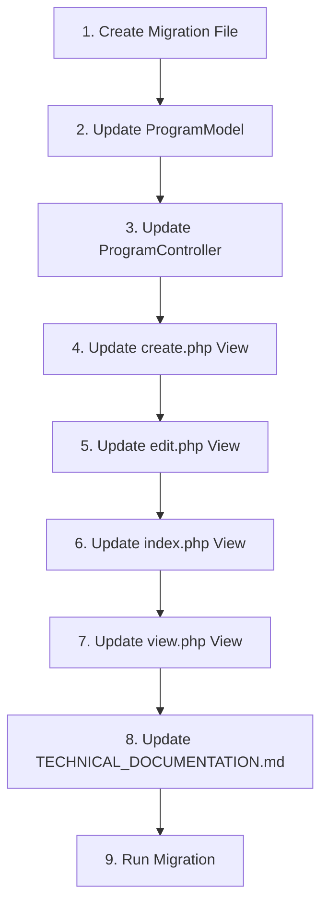

# Plan: Add Duration Column to Programs Table

## Overview

Add a new `duration` column (VARCHAR(255)) to the `programs` table to store the duration of language course programs (e.g., "3 months", "6 weeks", "1 year").

## Files to Modify

### 1. Database Migration

**File**: `app/Database/Migrations/2026-02-11-000000_AddDurationToProgramsTable.php` (new file)

**Purpose**: Add the `duration` column to the `programs` table.

**Schema**:

```php
'duration' => [
    'type' => 'VARCHAR',
    'constraint' => 255,
    'null' => true,
    'after' => 'sub_category'
]
```

---

### 2. Program Model

**File**: `app/Modules/Program/Models/ProgramModel.php`

**Changes**:

- Add `'duration'` to the `$allowedFields` array (line 15-31)

**Location**: After `'sub_category'` in the allowedFields array

---

### 3. ProgramController

**File**: `app/Modules/Program/Controllers/ProgramController.php`

**Changes**:

- Add `'duration'` to the `$data` array in `store()` method (line 92-107)
- Add `'duration'` to the `$data` array in `update()` method (line 172-194)

**Location**: After `'sub_category'` in both methods

---

### 4. Create View

**File**: `app/Modules/Program/Views/create.php`

**Changes**:

- Add duration input field in the "Basic Information" card section

**Location**: After the "Sub Category" field (around line 150)

**HTML to add**:

```html
<div class="col-md-6 mb-3">
  <label class="form-label">Duration</label>
  <input
    type="text"
    name="duration"
    class="form-control"
    value="<?= old('duration') ?>"
    placeholder="e.g., 3 months, 6 weeks"
  />
  <small class="text-muted"
    >Course duration (e.g., 3 months, 6 weeks, 1 year)</small
  >
</div>
```

---

### 5. Edit View

**File**: `app/Modules/Program/Views/edit.php`

**Changes**:

- Add duration input field in the "Basic Information" card section

**Location**: After the "Sub Category" field (around line 72)

**HTML to add**:

```html
<div class="col-md-6 mb-3">
  <label class="form-label">Duration</label>
  <input
    type="text"
    name="duration"
    class="form-control"
    value="<?= old('duration', $program['duration']) ?>"
    placeholder="e.g., 3 months, 6 weeks"
  />
  <small class="text-muted"
    >Course duration (e.g., 3 months, 6 weeks, 1 year)</small
  >
</div>
```

---

### 6. Index View (List)

**File**: `app/Modules/Program/Views/index.php`

**Changes**:

- Add "Duration" column to the table header (line 76-86)
- Add duration display in table body (line 91-129)
- Update colspan for "No programs found" row (line 133)

**Location**: After "Sub Category" column

---

### 7. View View (Details)

**File**: `app/Modules/Program/Views/view.php`

**Changes**:

- Add duration row in the "Category Information" table (line 44-74)

**Location**: After "Sub Category" row

**HTML to add**:

```html
<tr>
  <th>Duration:</th>
  <td><?= esc($program['duration'] ?? '-') ?></td>
</tr>
```

---

### 8. ProgramApiController

**File**: `app/Modules/Program/Controllers/Api/ProgramApiController.php`

**Changes**: No changes required - the API controller uses the model's `save()` and `update()` methods which will automatically handle the new field once it's added to `$allowedFields`.

---

### 9. Technical Documentation

**File**: `plans/TECHNICAL_DOCUMENTATION.md`

**Changes**:

- Add `duration` field to the `programs` table schema documentation (line 42-65)

**Location**: After `sub_category` field

**Field to add**:

```markdown
| duration | VARCHAR(255) | Course duration (e.g., 3 months, 6 weeks) |
```

---

## Implementation Order



---

## Testing Checklist

After implementation, verify:

- [ ] Migration runs successfully: `php spark migrate`
- [ ] Can create a new program with duration
- [ ] Can edit an existing program and update duration
- [ ] Duration displays correctly in program list (index)
- [ ] Duration displays correctly in program details (view)
- [ ] Duration is included in API responses
- [ ] Empty/null duration displays as "-" in views
- [ ] Bulk upload template includes duration column (optional enhancement)

---

## Notes

1. **Nullable Field**: The `duration` field is nullable to allow existing programs without duration data.

2. **Position**: The field is added after `sub_category` in the database schema for logical grouping with other basic information fields.

3. **Validation**: No additional validation rules are needed since the field is optional and accepts any text.

4. **API Compatibility**: The API will automatically include the new field in responses without code changes.

5. **Bulk Upload**: The bulk upload functionality may need the Excel template updated to include the duration column (future enhancement).
