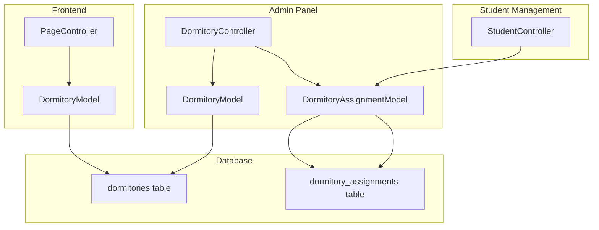
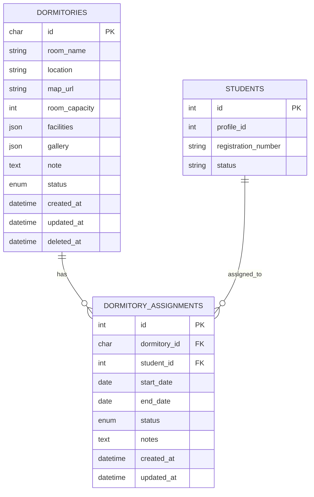

# Dormitory Module Architecture Plan

## Overview

A simplified dormitory management module for tracking room inventory, facilities, and availability. The module provides both admin management interface and public frontend display with real-time availability.

## Requirements Summary

### Room Management

- **Room Name**: Identifier like "Kirana A17 Sekat", "Kirana A17 Depan", "Kirana A17 Belakang"
- **Location**: Full address (e.g., "Perum Kirana Cluster Blok A No 17")
- **Map URL**: Google Maps or similar map link
- **Capacity**: Number of beds available
- **Facilities**: Dynamic list stored as JSON
- **Gallery**: Array of image URLs (thumbnail picked randomly on frontend)
- **Notes**: Additional text information

### Occupancy

- Admin can assign students to specific rooms
- Real-time availability display on frontend

### Frontend Display

- Public page showing dormitory catalog
- Room details with facilities and photos
- Random thumbnail from gallery

---

## Database Schema

### Table: `dormitories`

Simplified single-table design.

| Field         | Type         | Description                                                 |
| ------------- | ------------ | ----------------------------------------------------------- |
| id            | CHAR(36)     | UUID primary key                                            |
| room_name     | VARCHAR(255) | Room identifier (e.g., "Kirana A17 Sekat")                  |
| location      | VARCHAR(500) | Full address/location                                       |
| map_url       | VARCHAR(500) | Map URL (Google Maps, etc.)                                 |
| room_capacity | INT          | Total bed capacity                                          |
| facilities    | JSON         | Array of facility names                                     |
| gallery       | JSON         | Array of image URLs                                         |
| note          | TEXT         | Additional notes                                            |
| status        | ENUM         | available, full, maintenance, inactive (default: available) |
| created_at    | DATETIME     | Record creation timestamp                                   |
| updated_at    | DATETIME     | Last update timestamp                                       |
| deleted_at    | DATETIME     | Soft delete timestamp                                       |

### Table: `dormitory_assignments`

Student room assignments for tracking occupancy.

| Field        | Type                 | Description                    |
| ------------ | -------------------- | ------------------------------ |
| id           | INT (Auto Increment) | Primary key                    |
| dormitory_id | CHAR(36)             | Foreign key to dormitories     |
| student_id   | INT                  | Foreign key to students table  |
| start_date   | DATE                 | Assignment start date          |
| end_date     | DATE                 | Assignment end date (nullable) |
| status       | ENUM                 | active, completed, cancelled   |
| notes        | TEXT                 | Additional notes               |
| created_at   | DATETIME             | Record creation timestamp      |
| updated_at   | DATETIME             | Last update timestamp          |

---

## Module Structure

```
app/Modules/Dormitory/
├── Config/
│   ├── Routes.php          # Route definitions
│   └── Menu.php            # Sidebar menu configuration
├── Controllers/
│   ├── DormitoryController.php       # Admin CRUD operations
│   └── Api/
│       └── DormitoryApiController.php # API endpoints for frontend
├── Models/
│   ├── DormitoryModel.php            # Main dormitory model
│   └── DormitoryAssignmentModel.php  # Student assignments
└── Views/
    ├── index.php           # Room listing (admin)
    ├── create.php          # Create room form
    ├── edit.php            # Edit room form
    └── view.php            # Room details (admin)
```

### Frontend Integration

```
app/Modules/Frontend/
├── Controllers/
│   └── PageController.php  # Add dormitory display methods
└── Views/
    └── Dormitory/
        ├── index.php       # Public dormitory catalog
        └── detail.php      # Room detail page
```

---

## API Endpoints

### Admin Routes (Protected)

| Method | Endpoint                      | Description              |
| ------ | ----------------------------- | ------------------------ |
| GET    | `/dormitory`                  | List all rooms           |
| GET    | `/dormitory/create`           | Create room form         |
| POST   | `/dormitory/store`            | Store new room           |
| GET    | `/dormitory/show/{id}`        | View room details        |
| GET    | `/dormitory/edit/{id}`        | Edit room form           |
| POST   | `/dormitory/update/{id}`      | Update room              |
| POST   | `/dormitory/delete/{id}`      | Delete room              |
| GET    | `/dormitory/assignments/{id}` | View assignments         |
| POST   | `/dormitory/assign/{id}`      | Assign student to room   |
| POST   | `/dormitory/unassign/{id}`    | Remove student from room |

### Public Routes

| Method | Endpoint            | Description              |
| ------ | ------------------- | ------------------------ |
| GET    | `/dormitories`      | Public dormitory catalog |
| GET    | `/dormitories/{id}` | Room detail page         |

### API Routes (JSON)

| Method | Endpoint                     | Description                 |
| ------ | ---------------------------- | --------------------------- |
| GET    | `/api/dormitories`           | List all dormitories (JSON) |
| GET    | `/api/dormitories/{id}`      | Get single dormitory        |
| GET    | `/api/dormitories/available` | Get available rooms         |

---

## Data Flow Diagram



---

## Entity Relationship Diagram



---

## Permissions

| Permission         | Description                       |
| ------------------ | --------------------------------- |
| `dormitory.view`   | View dormitory list and details   |
| `dormitory.manage` | Create, edit, delete dormitories  |
| `dormitory.assign` | Assign/remove students from rooms |

---

## UI Components

### Admin - Room List

- Table with room name, location, capacity, availability, status
- Quick actions: View, Edit, Delete

### Admin - Room Form

- Room name input
- Location/address input
- Map URL input
- Capacity number input
- Facilities: Multi-select or tag input (JSON)
- Gallery: Multiple image upload (JSON array)
- Notes textarea
- Status dropdown: available, full, maintenance, inactive

### Frontend - Catalog

- Grid layout with room cards
- Random thumbnail from gallery
- Each card shows: Thumbnail, Name, Location, Capacity, Available beds
- Click for detail view

### Frontend - Detail

- Photo gallery with lightbox
- Room information
- Location with map link
- Facilities list with icons
- Availability status
- Contact/Apply button

---

## File Upload Structure

```
uploads/
└── dormitories/
    └── {uuid}/
        └── {filename}
```

---

## Implementation Order

1. **Database Migration** - Create tables
2. **Models** - DormitoryModel, DormitoryAssignmentModel
3. **Admin Controller** - CRUD operations
4. **Admin Views** - Index, Create, Edit, View
5. **Student Assignment** - Assign students to rooms
6. **Frontend Display** - Public catalog and detail pages
7. **API Endpoints** - JSON API for dynamic features
8. **Permissions** - Add to AuthGroups config

---

## Notes

- UUID is used for id to allow distributed generation
- Gallery is stored as JSON array of image URLs
- Thumbnail is picked randomly from gallery on frontend display
- Available beds calculated from active assignments vs capacity
- Facilities stored as JSON array for flexibility
