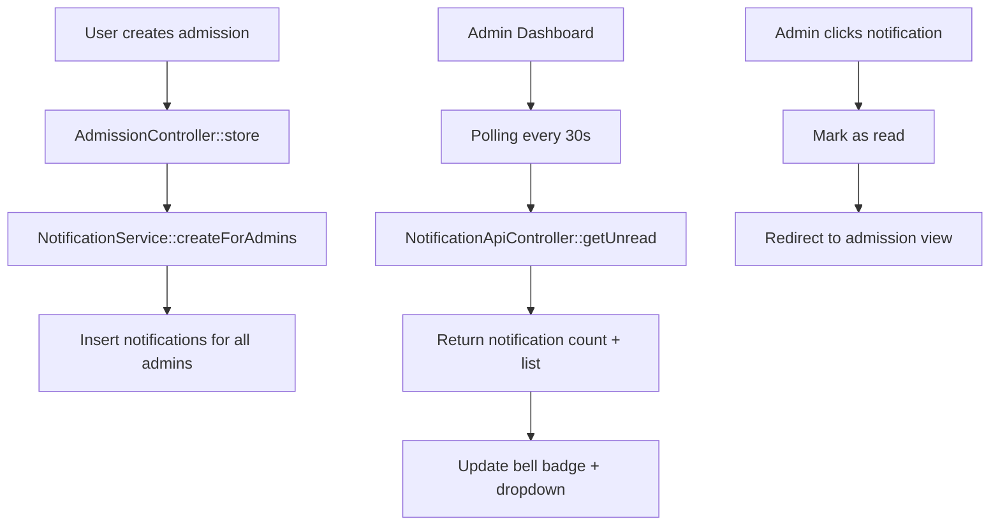

# Notification System Implementation Plan

## Overview

Implement a real-time notification system that notifies all admins (superadmin + admin roles) when a new admission is submitted by any user.

## Requirements Summary

- **Trigger**: New admission created
- **Recipients**: All users with `superadmin` or `admin` roles
- **Display**: Bell icon on dashboard topbar with real-time updates
- **Behavior**: Polling-based real-time updates (similar to existing messages feature)

## Architecture



## Database Schema

### notifications table

| Column     | Type               | Description                                               |
| ---------- | ------------------ | --------------------------------------------------------- |
| id         | INT AUTO_INCREMENT | Primary key                                               |
| user_id    | INT NOT NULL       | Recipient user ID (FK to users)                           |
| type       | VARCHAR(50)        | Notification type (e.g., `new_admission`)                 |
| title      | VARCHAR(255)       | Notification title                                        |
| message    | TEXT               | Notification message                                      |
| data       | JSON               | Additional data (e.g., admission_id, registration_number) |
| read_at    | DATETIME NULL      | When notification was read                                |
| created_at | DATETIME           | Creation timestamp                                        |
| updated_at | DATETIME           | Update timestamp                                          |

## File Structure

```
app/
├── Database/
│   └── Migrations/
│       └── 2026-02-13-150000_CreateNotificationsTable.php
├── Modules/
│   └── Notification/
│       ├── Config/
│       │   └── Routes.php
│       ├── Controllers/
│       │   └── Api/
│       │       └── NotificationApiController.php
│       └── Models/
│           └── NotificationModel.php
├── Services/
│   └── NotificationService.php
```

## Implementation Steps

### Step 1: Create Database Migration

Create migration file: `app/Database/Migrations/2026-02-13-150000_CreateNotificationsTable.php`

```php
<?php

namespace App\Database\Migrations;

use CodeIgniter\Database\Migration;

class CreateNotificationsTable extends Migration
{
    public function up()
    {
        $this->forge->addField([
            'id' => [
                'type' => 'INT',
                'constraint' => 11,
                'unsigned' => true,
                'auto_increment' => true,
            ],
            'user_id' => [
                'type' => 'INT',
                'constraint' => 11,
                'unsigned' => true,
            ],
            'type' => [
                'type' => 'VARCHAR',
                'constraint' => 50,
            ],
            'title' => [
                'type' => 'VARCHAR',
                'constraint' => 255,
            ],
            'message' => [
                'type' => 'TEXT',
                'null' => true,
            ],
            'data' => [
                'type' => 'JSON',
                'null' => true,
            ],
            'read_at' => [
                'type' => 'DATETIME',
                'null' => true,
            ],
            'created_at' => [
                'type' => 'DATETIME',
                'null' => true,
            ],
            'updated_at' => [
                'type' => 'DATETIME',
                'null' => true,
            ],
        ]);

        $this->forge->addKey('id', true);
        $this->forge->addKey('user_id');
        $this->forge->addKey(['user_id', 'read_at']);
        $this->forge->createTable('notifications');
    }

    public function down()
    {
        $this->forge->dropTable('notifications');
    }
}
```

### Step 2: Create NotificationModel

Create file: `app/Modules/Notification/Models/NotificationModel.php`

Key methods:

- `getUnreadForUser(userId)` - Get all unread notifications for a user
- `markAsRead(notificationId, userId)` - Mark a notification as read
- `markAllAsRead(userId)` - Mark all notifications as read for a user
- `getUnreadCount(userId)` - Get count of unread notifications

### Step 3: Create NotificationService

Create file: `app/Services/NotificationService.php`

Key methods:

- `createForAdmins(type, title, message, data)` - Create notifications for all admin users
- `notifyNewAdmission(admission)` - Specific method for new admission notifications

### Step 4: Create API Controller

Create file: `app/Modules/Notification/Controllers/Api/NotificationApiController.php`

Endpoints:

- `GET /notifications/api/unread-count` - Get unread notification count
- `GET /notifications/api/list` - Get list of notifications
- `POST /notifications/api/mark-read/{id}` - Mark notification as read
- `POST /notifications/api/mark-all-read` - Mark all as read

### Step 5: Create Routes

Create file: `app/Modules/Notification/Config/Routes.php`

```php
<?php

// Notification API Routes
$routes->group('notifications/api', ['namespace' => 'Modules\Notification\Controllers\Api'], function($routes) {
    $routes->get('unread-count', 'NotificationApiController::getUnreadCount');
    $routes->get('list', 'NotificationApiController::getList');
    $routes->post('mark-read/(:num)', 'NotificationApiController::markAsRead/$1');
    $routes->post('mark-all-read', 'NotificationApiController::markAllAsRead');
});
```

### Step 6: Modify AdmissionController

In `app/Modules/Admission/Controllers/AdmissionController.php`, modify the `store()` method:

After successful admission creation (around line 267), add:

```php
// Create notification for admins
$notificationService = new \App\Services\NotificationService();
$notificationService->notifyNewAdmission([
    'registration_number' => $admissionData['registration_number'],
    'program_id' => $programId,
    'program_title' => $program['title'],
    'applicant_name' => $profileData['full_name'],
]);
```

### Step 7: Update Layout View

Modify `app/Modules/Dashboard/Views/layout.php`:

1. Update the bell icon dropdown (lines 508-518) to dynamically load notifications
2. Add JavaScript polling similar to the messages feature (lines 618-646)

Changes needed:

- Add `id="notification-badge"` to the badge span
- Add `id="notification-list"` to the dropdown menu
- Add JavaScript to poll `/notifications/api/unread-count`
- Add JavaScript to load notification list on dropdown click

## UI Design

### Bell Icon Badge

```html
<div class="nav-item dropdown me-3">
  <a
    class="nav-link position-relative"
    href="#"
    role="button"
    data-bs-toggle="dropdown"
  >
    <i class="bi bi-bell fs-5"></i>
    <span
      class="notification-badge"
      id="notification-badge"
      style="display: none;"
      >0</span
    >
  </a>
  <div
    class="dropdown-menu dropdown-menu-end"
    id="notification-dropdown"
    style="min-width: 320px; max-height: 400px; overflow-y: auto;"
  >
    <h6 class="dropdown-header">Notifications</h6>
    <div id="notification-list">
      <!-- Notifications loaded here -->
    </div>
  </div>
</div>
```

### Notification Item Template

```html
<a
  href="/admission/view/123"
  class="dropdown-item notification-item"
  data-id="1"
>
  <div class="d-flex align-items-start">
    <div class="me-2">
      <i class="bi bi-person-plus text-primary"></i>
    </div>
    <div>
      <div class="fw-medium">New Admission</div>
      <small class="text-muted">John Doe applied for English Course</small>
      <div class="text-muted small">2 minutes ago</div>
    </div>
  </div>
</a>
```

## JavaScript Implementation

```javascript
// Poll for unread notifications
document.addEventListener("DOMContentLoaded", () => {
  const updateNotificationCount = () => {
    fetch("/notifications/api/unread-count")
      .then((res) => (res.ok ? res.json() : Promise.reject("Network error")))
      .then((data) => {
        const badge = document.getElementById("notification-badge");
        if (badge) {
          if (data.count > 0) {
            badge.textContent = data.count > 99 ? "99+" : data.count;
            badge.style.display = "flex";
          } else {
            badge.style.display = "none";
          }
        }
      })
      .catch((e) => console.error("Error fetching notifications:", e));
  };

  // Initial check
  updateNotificationCount();

  // Poll every 30 seconds
  setInterval(updateNotificationCount, 30000);

  // Load notifications when dropdown opens
  const notificationDropdown = document.getElementById("notification-dropdown");
  if (notificationDropdown) {
    notificationDropdown.addEventListener("show.bs.dropdown", () => {
      loadNotifications();
    });
  }
});

function loadNotifications() {
  fetch("/notifications/api/list?limit=10")
    .then((res) => (res.ok ? res.json() : Promise.reject("Network error")))
    .then((data) => {
      const list = document.getElementById("notification-list");
      if (list && data.notifications) {
        if (data.notifications.length === 0) {
          list.innerHTML =
            '<div class="dropdown-item text-center text-muted"><small>No new notifications</small></div>';
        } else {
          list.innerHTML = data.notifications
            .map((n) => renderNotification(n))
            .join("");
        }
      }
    })
    .catch((e) => console.error("Error loading notifications:", e));
}
```

## Security Considerations

1. **Authentication**: All API endpoints require authentication
2. **Authorization**: Users can only access their own notifications
3. **CSRF Protection**: POST endpoints use CSRF validation
4. **Input Validation**: All inputs are validated before processing

## Performance Considerations

1. **Indexing**: Database indexes on `user_id` and `read_at` columns
2. **Pagination**: Notification list limited to 10 items initially
3. **Polling Interval**: 30-second interval to balance real-time feel with server load
4. **Cleanup**: Consider adding a scheduled task to delete old read notifications

## Testing Checklist

- [ ] Run migration to create notifications table
- [ ] Create test admission and verify notification is created
- [ ] Verify notification appears for admin users
- [ ] Verify notification does NOT appear for non-admin users
- [ ] Test mark as read functionality
- [ ] Test mark all as read functionality
- [ ] Test real-time polling updates
- [ ] Test notification link redirects to correct admission

## Estimated Files to Create/Modify

| File                                                                     | Action |
| ------------------------------------------------------------------------ | ------ |
| `app/Database/Migrations/2026-02-13-150000_CreateNotificationsTable.php` | Create |
| `app/Modules/Notification/Config/Routes.php`                             | Create |
| `app/Modules/Notification/Models/NotificationModel.php`                  | Create |
| `app/Modules/Notification/Controllers/Api/NotificationApiController.php` | Create |
| `app/Services/NotificationService.php`                                   | Create |
| `app/Modules/Admission/Controllers/AdmissionController.php`              | Modify |
| `app/Modules/Dashboard/Views/layout.php`                                 | Modify |
